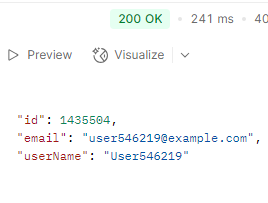
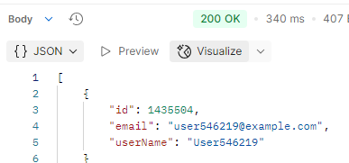
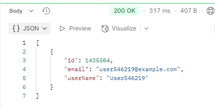
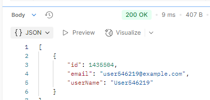

# 📌 프로젝트 개요
프로젝트명: spring-plus

기반 기술: Java 17, Spring Boot, JPA, QueryDSL

💠 주요 개선 사항
-

1️⃣ 기존 프로젝트에 jpql 적용
-

    @Configuration
    public class QuerydslConfig {
    @PersistenceContext
    private EntityManager entityManager;

    @Bean
    public JPAQueryFactory jpaQueryFactory() {
        return new JPAQueryFactory(entityManager);
    }
    }
    //Querydsl 추가
    implementation 'com.querydsl:querydsl-jpa:5.0.0:jakarta'
    annotationProcessor "com.querydsl:querydsl-apt:${dependencyManagement.importedProperties['querydsl.version']}:jakarta"
    annotationProcessor "jakarta.annotation:jakarta.annotation-api"
    annotationProcessor "jakarta.persistence:jakarta.persistence-api"

Q 타입 생성 > Gradle로 설정
-
InteliJ에서 우측 상단 코끼리모양(Gradle) 클릭 후 clean 후 compileJava 실행
Gradle -> Tasks -> build -> clean
Gradle -> Tasks -> other -> compileJava

콘솔에서 사용시 gradle clean compileJava

2️⃣ Spring Security 적용
-
```java
implementation 'org.springframework.boot:spring-boot-starter-security'


@Configuration
@EnableWebSecurity
@EnableMethodSecurity

public class SecurityConfig {

    private final JwtFilter jwtFilter;

    public SecurityConfig(JwtFilter jwtFilter) {
        this.jwtFilter = jwtFilter;
    }

    @Bean
    public SecurityFilterChain securityFilterChain(HttpSecurity http) throws Exception {
        http
            // CSRF 보호 비활성화 (REST API이므로)
            .csrf(csrf -> csrf.disable())

            // 인증/인가 설정
            .authorizeHttpRequests(authorize -> authorize
                // 인증이 필요없는 공개 API
                .requestMatchers("/auth/**").permitAll()
                // 특정 권한이 필요한 API
                .requestMatchers("/admin/**").hasRole("ADMIN")
                // 나머지 모든 요청은 인증 필요
                .anyRequest().authenticated()
            )

            // 폼 로그인 비활성화 (REST API 이므로)
            .formLogin(formLogin -> formLogin.disable())

            // HTTP Basic 인증 비활성화
            .httpBasic(httpBasic -> httpBasic.disable())

            // 세션 관리 설정 (JWT를 사용하므로 상태 비저장)
            .sessionManagement(session -> session
                .sessionCreationPolicy(SessionCreationPolicy.STATELESS)
            )

            // 예외 처리 설정
            .exceptionHandling(exceptions -> exceptions
                .authenticationEntryPoint((request, response, authException) -> {
                    response.sendError(401, "Unauthorized: " + authException.getMessage());
                })
                .accessDeniedHandler((request, response, accessDeniedException) -> {
                    response.sendError(403, "Access Denied: " + accessDeniedException.getMessage());
                })
            );
        // JWT 필터 등록 - UsernamePasswordAuthenticationFilter 이전에 실행;
        http.addFilterBefore(jwtFilter, UsernamePasswordAuthenticationFilter.class);
        return http.build();
    }

    @Bean
    public PasswordEncoder passwordEncoder() {
        return new BCryptPasswordEncoder();
    }
}
```
주로 컨트롤러에서 파라미터로 매핑할 떄 argumentResolver 사용했는데
@AuthenticationPrincipal 활용으로 바꿈

3️⃣ aws 이미지 업로드 기능
-

```java
// application.properties
cloud.aws.s3.bucket=delivery-project-files
cloud.aws.region.static=ap-southeast-2
cloud.aws.s3.path.review=reviews
cloud.aws.stack.auto=false
cloud.aws.credentials.access-key=
cloud.aws.credentials.secret-key=

//img s3
implementation 'software.amazon.awssdk:s3:2.20.89'

//config
@Configuration
public class CustomS3Config {

    @Value("${cloud.aws.credentials.access-key}")
    private String accessKey;

    @Value("${cloud.aws.credentials.secret-key}")
    private String secretKey;

    @Value("${cloud.aws.region.static}")
    private String region;

    @Bean
    public S3Client s3Client() { //aws 클라이언트 생성
        AwsBasicCredentials credentials = AwsBasicCredentials.create(accessKey, secretKey); // 접근 증명
        return S3Client.builder()
            .credentialsProvider(StaticCredentialsProvider.create(credentials))
            .region(Region.of(region))
            .build();
    }

}

```

aws s3에 이미지를 업로드 하고 url 반환에서 공통 db에 저장<br>
태그 컬럼을 통해 구분 <br><br>사용 시 컨트롤러에서 @Image 커스텀 어노테이션 활용해
aop 적용 파일 유효성 검사 <br><br>
서비스에서 호출만 하면 사용가능 타겟 id, type , MultipartFile 만 넘겨주면 처리해줌


4️⃣ 대용량 데이터 처리
-
```java
//User Entity
@Table(
    name = "users",
    indexes = {
        @Index(name = "idx_user_name", columnList = "userName"),
        @Index(name = "idx_user_email", columnList = "email")
    }
)

//Test 코드
@Test
@Transactional
@Rollback(false)
void setUp(){
    List<User> users = new ArrayList<>();
    for (int i = 1; i <= 1_000_000; i++) {
        User user = new User(
            "user" + i + "@example.com",
            "password" + i,
            UserRole.USER,
            "User" + i
        );
        users.add(user);

        // 배치 단위로 flush & clear
        if (i % 1000 == 0) {
            userRepository.saveAll(users);
            users.clear();
            em.flush();
            em.clear();
        }
    }

    // 남은 유저 저장
    if (!users.isEmpty()) {
        userRepository.saveAll(users);
        em.flush();
        em.clear();
    }

    System.out.println("유저 100만명 저장 완료");
}
//gradle-wrapper.properties 메모리 부족한 경우
org.gradle.jvmargs=-Xmx2g
```
기존 User Entity 에 인덱스 적용

아래는 100만건을 넣고 성능 비교

설정 x 조회
-
Query Dsl



JPA 



JPQL



기존 방법은 Querydsl 이 젤 빠른데 조회 컬럼을 최소화 해서 차이가 난다

---

인덱싱 적용
-

```java
@Table(
    name = "users",
    indexes = {
        @Index(name = "idx_user_name", columnList = "userName"),
        @Index(name = "idx_user_email", columnList = "email")
    }
)
```



3가지 전부 9,10ms로 압도적으로 성능이 좋아졌다
